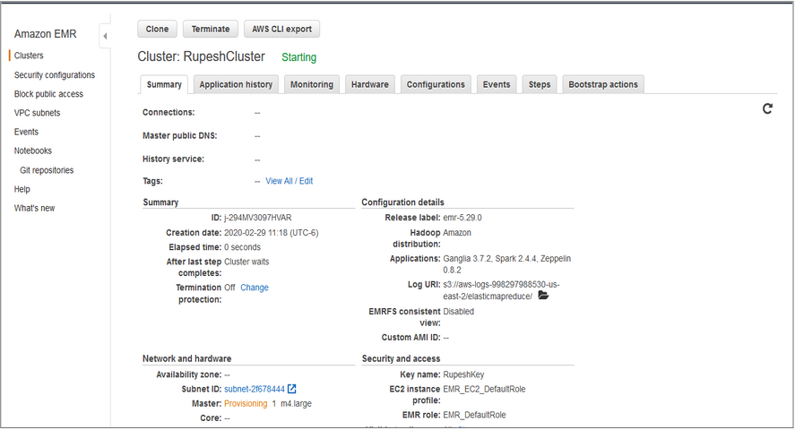
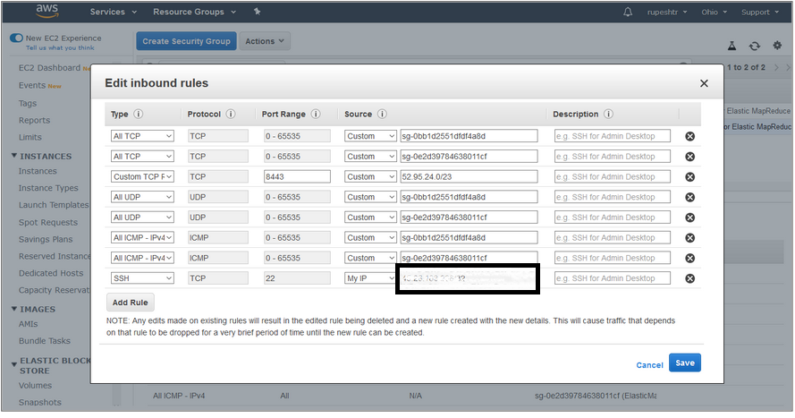

# AWS EMR Spark 

**Steps for Deploying Spark App on Amazon EMR**

- **Step 1** 

  Test your application using Scala - ide using sample data.

  

  

- **Step 2**

  - Remove all local path and Spark Context master local reference from Scala file.

  - Use SBT to package your application

    - Create and empty directory **sbt**
    - **sbt new scala/hello-world.g8.** 
    - add your scale files under sbt\movies\src\main\scala directory
    - edit sbt\movies\built.sbt

  - ```yaml
    name := "MostRatedMovies100k"
    
    version := "1.0"
    
    organization := "com.forsynet.sparkemr"
    
    scalaVersion := "2.11.12"
    
    libraryDependencies ++= Seq(
    "org.apache.spark" %% "spark-core" % "2.4.5" % "provided"
    )
    ```

    

  - at command prompt run command "sbt assembly"

  - This will create jar files with all dependencies under sbt\movies\target\scala-2.11\MostRatedMovies100k-assembly-1.0.jar

- **Step 3**

  - upload the jar files and the data files to s3 bucket .Use UI or below cli commands

  - ```powershell
    aws configure
    aws s3api create-bucket --bucket rupeshemr
    aws s3 sync data/
    
    ```

    - Verify the data is uploaded to s3 bucket
    - 


## Create an Amazon EMR cluster

- **Step 4**

- Use the aws cli or the UI to create the cluster.

- ```shell
  aws emr create-cluster \
      --instance-type m3.xlarge \
      --release-label emr-5.10.0 \
      --service-role EMR_DefaultRole \
      --ec2-attributes InstanceProfile=EMR_EC2_DefaultRole \
      --security-configuration mySecurityConfiguration \
      --kerberos-attributes file://kerberos_attributes.json
  ```

  - Verify Cluster Creation
  - 

  - **Step5**

  - Add SSH Inbound rule to security groups
  - 

- **Step 6**
- ssh into emr master node
- 

- copy the jar file from s3 bucker 

- ```
  aws s3 cp s3://rupeshemr/MostRatedMovies-1.0.jar ./
  ```

  


## Submit the Spark Job

- **Step 7**

  - ```sh
    spark-submit MostRatedMovies-1.0.jar
    ```

- Verify Results of top rated movies
  - 

- Use the Spark History Server UI to see the Spark Job History for submitted job
- 


- Verify Amazon s3 bucket for logs created for the job

